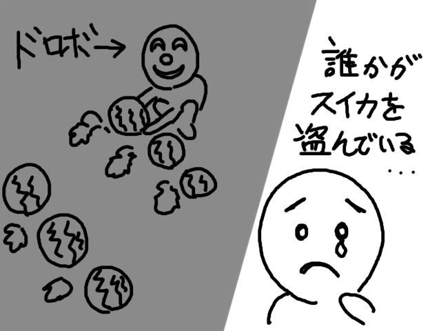
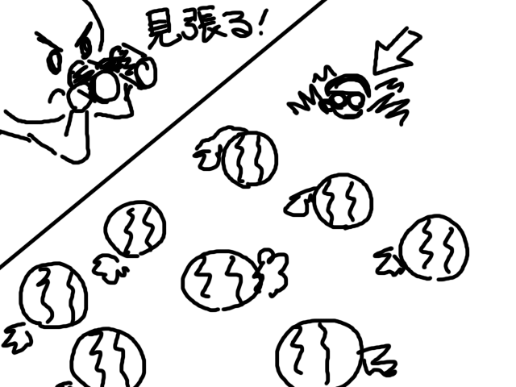
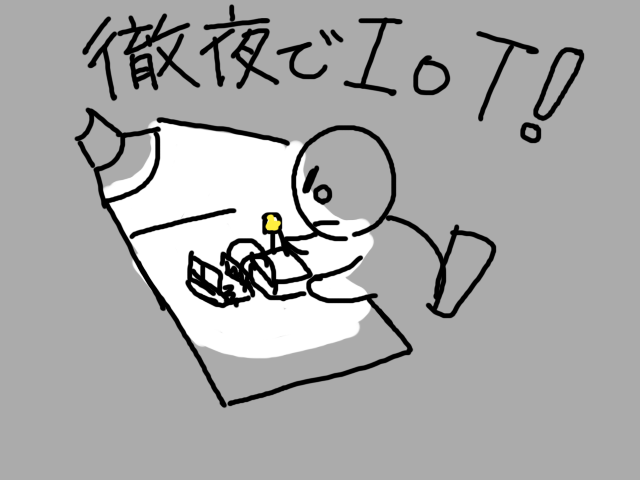
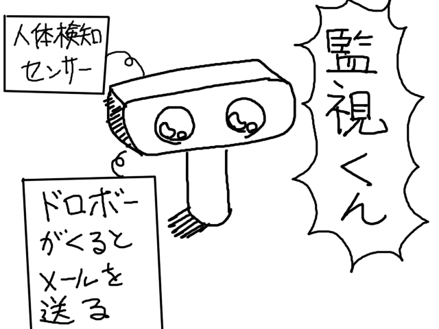
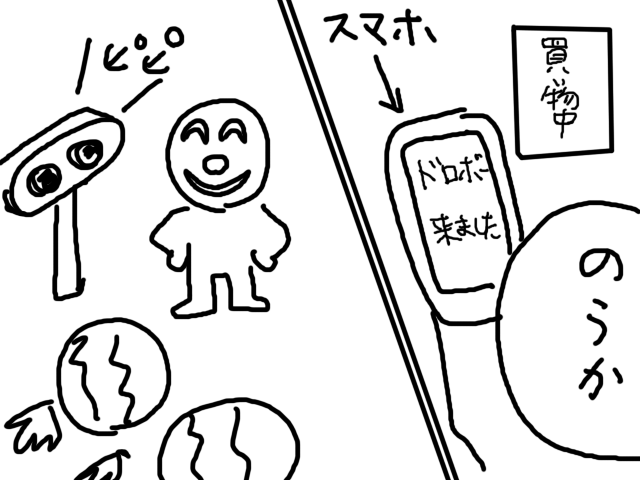
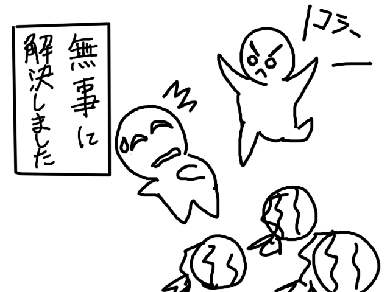
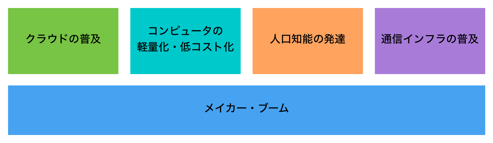
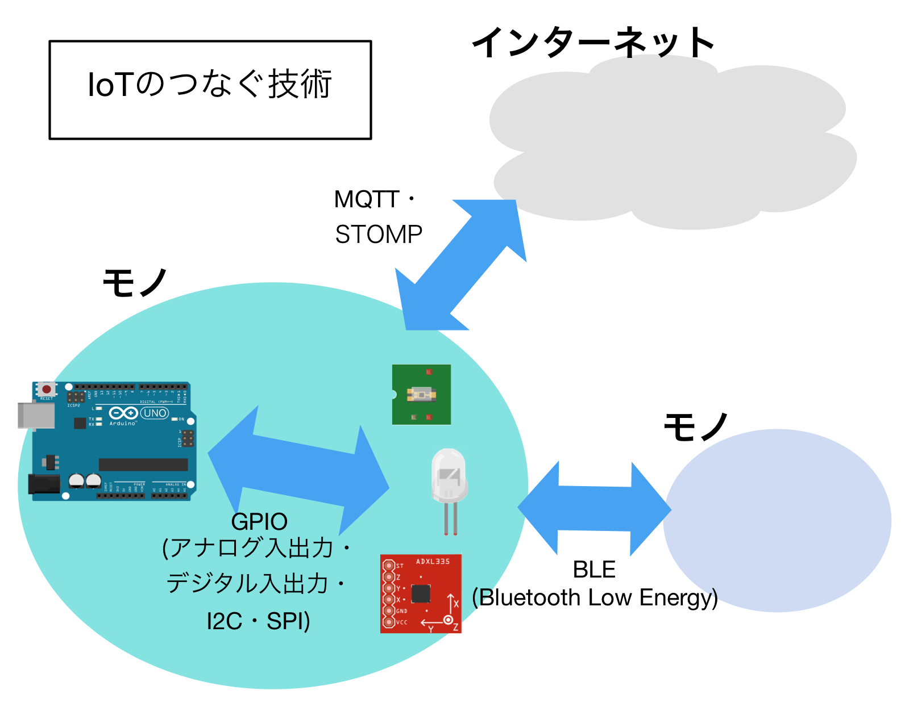

# IoTって何だろう

みなさんは、**IoT**という言葉を聞いたことがありますか？もしかしたら、新聞やテレビのニュースで知っているという人もいるかもしれません。**IoT**はInternet Of Thingsの略です。日本語だと**モノのインターネット**ということになります。

インターネットを使って、みなさんは調べ物をしたりYouTubeやニコニコ動画で動画を楽しんだりしていると思います。私たちは例えば北海道の〇〇さんが公開している小説を読んだり、イギリスの〇〇さんが公開しているイラストを見たりして、どこか遠くに離れた人が公開した情報にアクセスできます。これは、インターネットという仕組みのおかげなんです。

さて、**モノのインターネット**というのは、モノとモノ同士がインターネットでつながっているということです。モノが情報を蓄えたり、その情報をどこかに送ったりすることができる。単純なことですが、こんなことで世の中がちょっと便利になったり賢くなるものなのです。**IoT**をうまく活かすことで、私たちは今まで分からなかったことを知ることができたり、人間のちからをわざわざ使っていた無駄を省くことができるようになります。

## スイカづくりの話

例をみてみましょう。IoTを使って困っていたことが改善された例です。

あるところにスイカを作っている人がいました。彼にはある悩みがあります。大切に育てたスイカを誰かが盗んでいるようなのです。

そこで、彼は24時間スイカを見守ることにしました。しかし、何時間もスイカの監視していることで、買い物をしたり睡眠をとったりすることができなくなってしまいました。

そんな不便を解決するために、彼はIoTを勉強してドロボー見張り装置を開発することにしました。

そうしてできたものが「監視くん」です。この装置は、誰かがスイカ畑に入ってきたら、メールで知らせてくれる機能を持っています。

「監視くん」のおかげで買い物に行くことができるようになりました。ドロボーが来たら、すぐにスマホへ「ドロボーが来ました」とメールが来ます。

こうして、ドロボーを捕まえることができ、スイカを守ることができました。終わり。

まとめます。

* 「監視くん」は、インターネットを通して畑に人がいるかどうかの情報を教えてくれる
* スイカづくりは、「監視くん」のおかげでスイカを監視する手間を省くことができました

## IoTブーム

今なぜIoTが叫ばれているのでしょうか？IoTのブームは、次のような事情に支えられています。

* コンピュータの軽量化・低コスト化
* クラウドの普及
* 人工知能の発達
* 通信インフラの普及
* メイカームーブメント

コンピュータの軽量化・低コスト化とは、コンピュータが安くなったことと小さくなったことを指します。私たちが今日使っているパソコンやスマホは、30年前に使われていたコンピュータよりも小さくて軽いですし、また安くて高性能です。あとで紹介するArduinoもコンピュータの仲間です。Raspberry Pi Zeroというライターサイズのコンピュータを役500円で買うことができます。現代は昔の人が手が出せなかったコンピュータを手軽に買うことができる時代なのです。

昔ならば企業でしか使うことができなかったサーバを、今では個人ユーザでもお手軽に借りることができるようになりました。せっかくデータを収集できても、記録する場所（サーバ）がないとはじまりませんね。このような事情が、クラウドの普及に当たります。

人工知能(AI)、とりわけ機械学習と呼ばれる技術を使うことで、集めたデータから法則を調べることができます。この機械学習の技術が成熟してきたこともあり、データをビジネスに活かそうという動きが強まっています。

モノ同士をつなぐ通信プロトコルとしてのBluetooth Low Energy(BLE)やモノとインターネットをつなぐ通信プロトコルであるMQTTの普及も、IoTブームには欠かせませんでした。これらの通信規格を用いることにより、モノの消費電力を抑えることが可能になりました。

またIoTのブームは、メイカームーブメントと呼ばれるデバイスやサービス開発のムーブメントにも下支えされています。3Dプリンタやプロトタイピングボードの普及により、個人単位〜小規模チームでもハードウェア・デバイスの開発が可能になりました。また、クラウドファインディングと呼ばれる不特定多数から出資を受けて、製品を世に出すことも珍しくなくなってきています。

IoTというコンセプトは新しいものではありません。例えば、TRONというOSで著名な研究者 坂村健さんは、1980年代にすでに「どこでもコンピュータ」というIoTに通じるコンセプトを打ち出していました。しかし、当時はまだコンピュータが高価だったこともあり、坂村健さんが描いた「どこでもコンピュータ」が普及することはありませんでした。つまり、これまで見てきたような背景があってようやく「どこでもコンピュータ」は名前と変えて、IoTとして実現されるようになってきたのです。

## IoTの「つなぐ」技術

モノとモノ、モノとインターネットが結びついていくIoTの世界観では、モノとなるデバイスが最小単位になっています。またモノ内部でも、ArduinoやRaspberry PiといったボードがセンサーやLEDといったパーツとつながっています。

今回は、FaBoというツールとArduinoを使ってお手軽にデバイスを作る方法を紹介していきます。

## 参考

* 舘野祐一, "Arduino、Raspberry Piで電子工作 はじめてのIoT", WEB+DB PRESS Vol.92, 2016
* 坂村健, "痛快!コンピュータ学", 集英社, 2002
