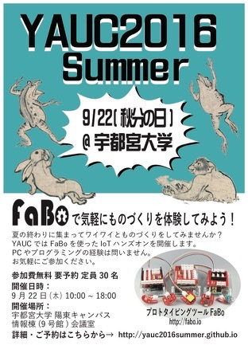

# Enjoy-IoT

[YAUC 2016 Summer](https://yauc2016summer.github.io/)用のテキストです。対象は中学生〜高校生を想定して作りました。

* [IoT](IoT.md)
    * IoT(Internet Of Things)とは何か、なんでブームになっているのか
* [Arduino](arduino.md)
    * Arduinoとは何か、Arduinoを使ったプログラミングの方法
* [FaBo](fabo.md)
    * FaBoとは何か、FaBoの使い方
* [Unity](unity.md)
    * Unityとは何か、Unityを使ったゲームづくりの方法

---

