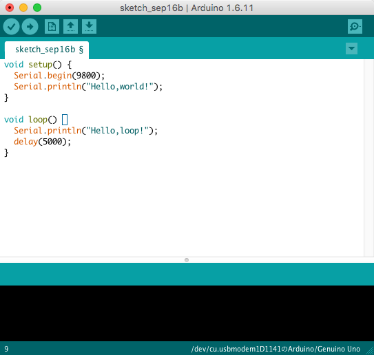

# Arduino


> Arduino UNO [wikipedia](https://en.wikipedia.org/wiki/Arduino)より

Arduinoは、誰でも気軽にIoTをはじめられるマイコンボードです。アルドゥイーノと読みます。Arduinoにはたくさんの種類があり、もっとも広く使われているArduino UnoやライターサイズのArduino Nanoがあります。他にもマイコンボードは、Raspberry PI、mbed、Ichigojamなどがあります。他のボードも使いやすいので、Arduinoに慣れてしまえば乗り換えるのも簡単ですよ。

今回は、Arduino Uno(アルドゥイーノ・ウノ)を使っていきたいと思います。

Arduinoを使ってIoTをはじめるうえで、ポイントとなるのは次の2点です。

1. LEDやセンサーなどパーツとArduinoをつなげる
1. Arduino上で動くプログラムをつくる

LEDライトを点滅させたり、センサーで外部の情報を取得するために、Arduino本体と各パーツを適切につなぐ必要があります。配線には少しばかり電気についての知識が必要で、間違った配線をしてしまうと、パーツを故障させたり、Arduino本体が動かなくなってしまう可能性があります。


そこで、パーツの仕様書やデータシートを読み、気をつけるべき点を理解したうえでArduinoとパーツをつなぐことになります。しかし、仕様書やデータシートは慣れないと読むのに苦労するので、初心者には大きな負担です。そんなときにFaBoと呼ばれるパーツを使うことで、細かいことを気にせずに、使いたいパーツとArduinoをつなぐことができるようになります。FaBoについてはあとで詳しく説明します。

さて、ここではさきほど上に挙げた2点目の「Arduino上で動くプログラムをつくる」について詳しく見ていきたいと思います。

## Arduinoプログラミング

Arduinoで動くプログラムの作り方を説明します。まずArduino IDEというアプリケーション上でソースコードを作成します。ソースコードとは、例えば`a = 1 + 2;`や`print("こんにちは");`といった文章になります。あなたがArduinoにやってほしいことを「センサーから値を読み取ってください」、「LEDを点滅させてください」といったように書いていくのです。実際には、ソースコードを日本語ではなくプログラミング言語で書きます。

そのときの注意ですが、文法と呼ばれるプログラミング言語のルールに従ってソースコードを書かないといけません。例えば、「吾輩を猫である」という文章は日本語の文法としておかしいですね。正しくは「吾輩は猫である」です。文法的に間違っているソースコードはその都度、Arduino IDEが教えてくれます。焦らずに1つずつ直していきましょう。

ソースコードが完成したら、ビルドをする必要があります。ソースコードのままでは、Arduinoは動きません。なので、ビルドという作業を行うことで、「01010011」のような機械語と呼ばれるArduinoがわかる文章に変換するのです。

ビルドを終えたら、パソコンからArduinoにプログラムを転送します。パソコンとArduinoの接続にはUSBケーブル(Type-B)を使います。いよいよArduinoでプログラムを動かす準備が整いました。

その前にこれまでの作業をまとめておきましょう。下のような図になります。


## インストール方法

Arduino IDEのインストール方法を説明します。

### Windows7

https://www.arduino.cc/en/Main/Software にアクセスし、「Windows Installer」をクリックします。


ページの下の方にあるJUST DONWLOADをクリックします。


「実行または保存しますか？」と聞かれるので、「実行」をクリックします。ダウンロードが開始するのでしばらく待ちます。


ダウンロードが終了すると、下のようなポップアップが表示されます。「はい」をクリックしましょう。


下のような画面が表示されます。「I Agree」をクリックしましょう。


「Next」をクリックしましょう。


「Install」をクリックしましょう。


インストールが開始されました。


ときおり下のような画面が表示されるかもしれません。「インストール」をクリックしましょう。


インストールが完了しました。「Close」をクリックしましょう。


### Mac OSX

https://www.arduino.cc/en/Main/Software にアクセスし、「Mac OS X 10.7 Lion or newer」をクリックします。


ページの下の方にあるJUST DONWLOADをクリックします。すると、ダウンロードが開始します。


## Hello, world!

簡単なプログラムからはじめます。



まずはArduino IDEを起動しましょう。下のソースコードを入力してみましょう。これは、"Hello,world!"と表示したあと、5秒おきに"Hello,loop!"と表示するプログラムです。

```ino
void setup() {
  Serial.begin(9800);
  Serial.println("Hello,world!");
}

void loop() {
  Serial.println("Hello,loop!");
  delay(5000);
}
```

入力が終わったら、ファイル > 保存をクリックします。Command + Sでも保存できます。


「HelloWorld」と入力し、「Save」をクリックします。


次に、左上にあるチェックマークをクリックします。


いよいよプログラムをArduinoに転送します。パソコンとArduinoをつなげてみましょう。

接続したら、ツール > シリアルポート > ???をクリックします。???の部分は接続したArduinoになるようにします。


右矢印のマークをクリックします。これで転送が完了します。


プログラムの実行結果をみてみましょう。右上にある虫眼鏡マークをクリックします。


下のような画面が表示されました。無事にプログラムが実行されているようです。


## 文法

下のソースコードをビルドして動かしてみましょう。動いたら、数字を変えてみたりしていじってみましょう。

```ino
// 1行のコメント
/* 
 * 複数行の
 * コメント
 * です
 */

/*
 * 関数
 * 
 * 戻り値の型 関数名(引数の型 引数名) {
 *   // 関数の中身
 * }
 */

// 引数の値を足したものを返します
int add(int a, int b) {
  // 整数型の変数cを使います
  // 整数型の変数には、0や1、1000、-320といった数しか入りません
  int c;
  // 変数cに、引数aとbを足したものを入れます
  c = a + b;
  // 変数cを戻します
  return c;
}

// Good bye!と表示します
void goodbye() {
  Serial.println("Good bye");
}

/*
 * 起動時に1度だけ実行されます
 */
void setup() {
  // おまじない: シリアル通信の設定
  Serial.begin(9800);
  // "Hello,world!"と表示します
  Serial.println("Hello,world!");

  // Good bye!と表示します
  // 下のようにして関数を呼び出します
  goodbye();
  
  // 整数型の変数xを使います
  int x;
  // 3 + 4を計算します
  x = add(3, 4);
  // 変数の中身を見てみましょう
  // 7と表示されるはずです
  Serial.println(x);

  // 整数型の変数yを使います
  int y;
  // おまじないです
  randomSeed(analogRead(0));
  // 0,1,2,3,4,5の数のうち、どれかが出力されます
  // 数字はちょっと違いますが、サイコロと同じです
  y = random(6);
  Serial.println(y);
  // 0が出たら、Great!
  // 1が出たら、Super!
  // 3が出たら、Good!
  // それ以外なら、Soso
  // と表示させてみます
  if (y == 0) {
    Serial.println("Great!");
  } else if (y == 1) {
     Serial.println("Super!");
  } else if (y == 3) {
    Serial.println("Good!");
  } else {
    Serial.println("Soso");
  }

  // 5回"Hello"と表示します
  // 整数型の変数iを使います
  int i;
  for (i = 0; i < 5; i++) {
    Serial.println("Hello");
  }
}

/* 
 *  繰り返し実行されます
 */
void loop() {
  
  // 1マイクロ秒間、プログラムを停止します
  // 1秒は1000マイクロ秒となります
  delay(1 * 1000);
}

/*** 実行結果 ***
Hello,world!
Good bye
7
0
Great!
Hello
Hello
Hello
Hello
Hello
****************/
```

