# FaBoとUnityの連携

下の動画のように、ボタンを押してロボットをジャンプさせるゲームを作りましょう。

* [YouTube](https://www.youtube.com/watch?v=abzupULmfjk)

## コントローラーの作成

FaBoのボタンパーツを使います。

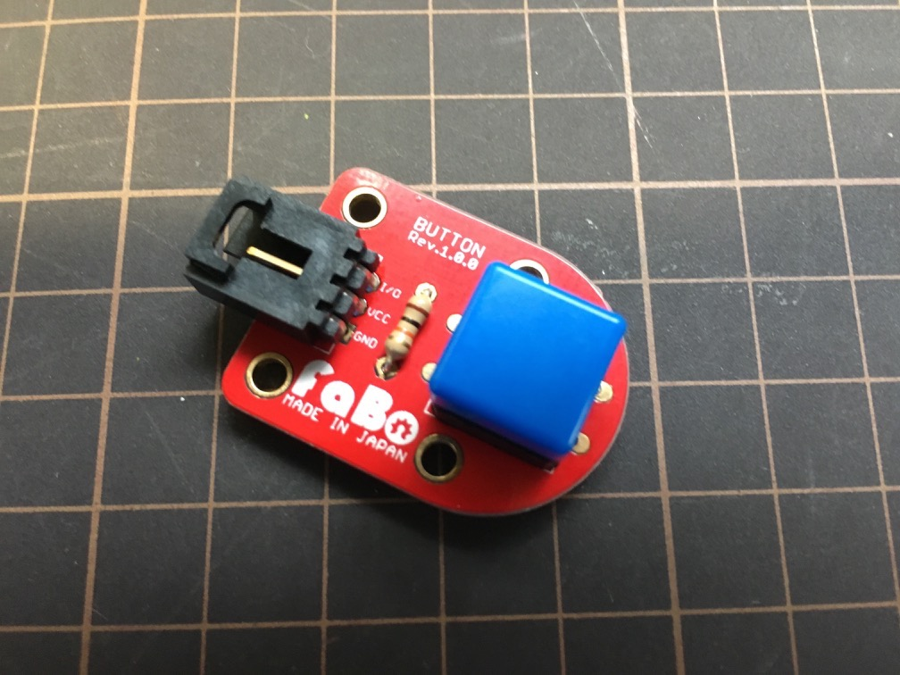

シールドの4番ピンにコネクタを指します。


## Arduinoプログラムの作成

Arduino IDEを開きます。下のようなソースコードを加えます。

```uno
void setup() {
  // シリアル通信のbps設定
  Serial.begin(9800);
  // ボタンピンを入力用に設定
  pinMode(4, INPUT);
}

void loop(){
  // ボタンが押されているか調べます
  if (digitalRead(4); == HIGH) {
    // ボタンが押された場合
    Serial.print(1); Serial.print("\t");
    Serial.println();
  }

  // 50マイクロ秒 プログラムを停止します
  delay(50);
}
```

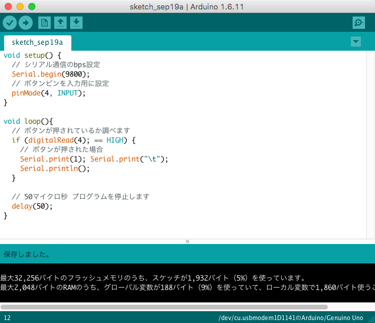

ビルドしてArduino上でプログラムを実行してみましょう。ボタンを押すと、「1」と表示されているはずです。

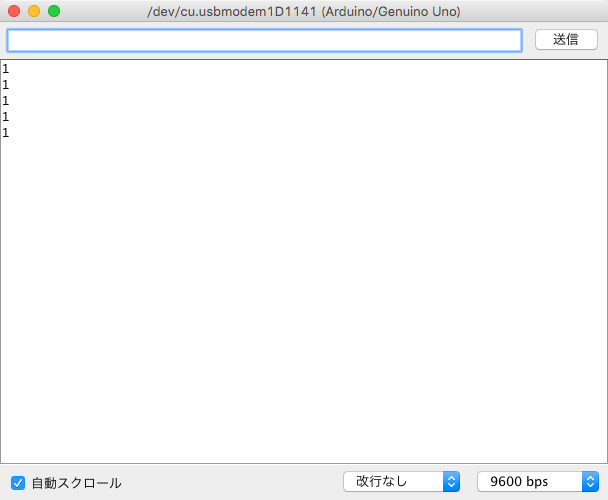

## コントローラーとUnityのゲームをつなぐ

Arduinoから出力される「1」を、ゲームで受け取れるようにしましょう。

まず上のほうにある「Edit」 > 「Project Setting」 > 「Player」をクリックします。

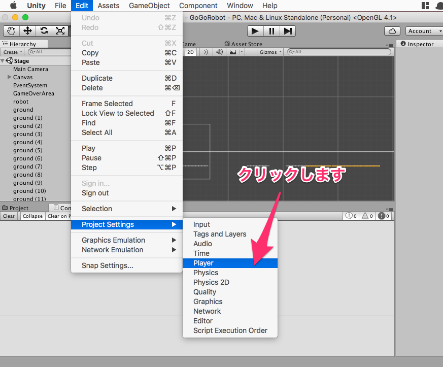

インスペクター部分の下のほうにある「Other Settings」をクリックします。

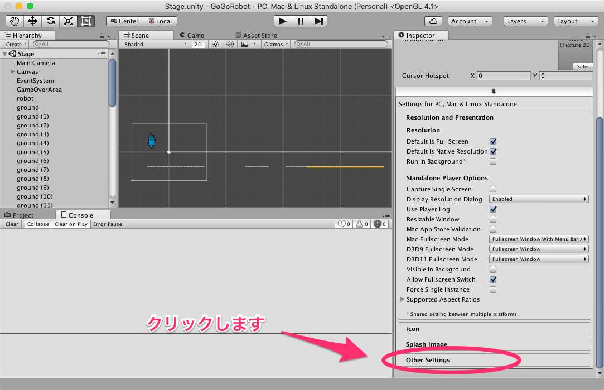

「Api Compatibility Level」の「.NET 2.0 Subset」を「.NET 2.0」に変更します。

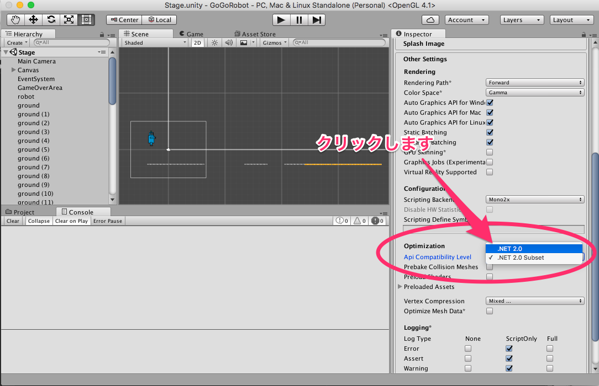

プロジェクトエリアで右クリックをして、「Create」 > 「C# Script」をクリックします。スクリプトの名前を「SerialHandler」に変更します。

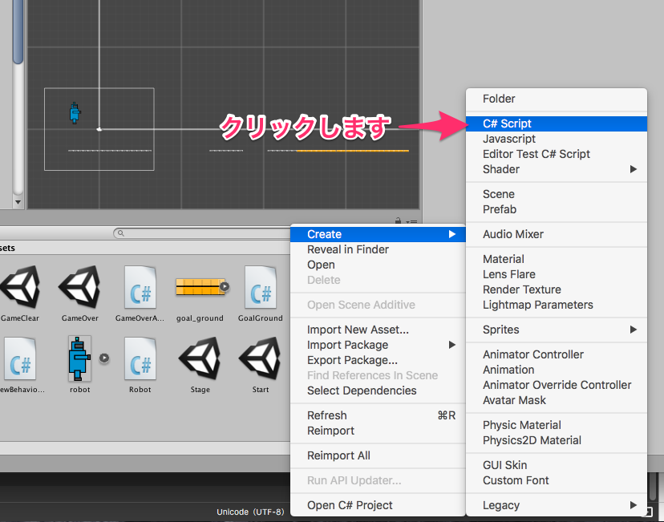

「SerialHandler」スクリプトをダブルクリックしてエディタを開き、下のようなコードを追加します。

```cs
using UnityEngine;
using System.Collections;
using System.IO.Ports;
using System.Threading;

public class SerialHandler : MonoBehaviour
{
    public delegate void SerialDataReceivedEventHandler(string message);
    public event SerialDataReceivedEventHandler OnDataReceived;

    //ポート名
    //例
    //Linuxでは/dev/ttyUSB0
    //windowsではCOM1
    //Macでは/dev/tty.usbmodem1421など
    public string portName = "COM1";
    public int baudRate    = 9600;

    private SerialPort serialPort_;
    private Thread thread_;
    private bool isRunning_ = false;

    private string message_;
    private bool isNewMessageReceived_ = false;

    void Awake()
    {
        Open();
    }

    void Update()
    {
        if (isNewMessageReceived_) {
            OnDataReceived(message_);
        }
        isNewMessageReceived_ = false;
    }

    void OnDestroy()
    {
        Close();
    }

    private void Open()
    {
        serialPort_ = new SerialPort(portName, baudRate, Parity.None, 8, StopBits.One);
         //または
         //serialPort_ = new SerialPort(portName, baudRate);
        serialPort_.Open();

        isRunning_ = true;

        thread_ = new Thread(Read);
        thread_.Start();
    }

    private void Close()
    {
        isNewMessageReceived_ = false;
        isRunning_ = false;

        if (thread_ != null && thread_.IsAlive) {
            thread_.Join();
        }

        if (serialPort_ != null && serialPort_.IsOpen) {
            serialPort_.Close();
            serialPort_.Dispose();
        }
    }

    private void Read()
    {
        while (isRunning_ && serialPort_ != null && serialPort_.IsOpen) {
            try {
                if (serialPort_.BytesToRead > 0) {
                    message_ = serialPort_.ReadLine();
                    isNewMessageReceived_ = true;
                }
            } catch (System.Exception e) {
                Debug.LogWarning(e.Message);
            }
        }
    }

    public void Write(string message)
    {
        try {
            serialPort_.Write(message);
        } catch (System.Exception e) {
            Debug.LogWarning(e.Message);
        }
    }
}
```

> 参考: [UnityとArduinoをシリアル通信](http://qiita.com/yjiro0403/items/54e9518b5624c0030531#serialhandlercs)

作ったスクリプトをゲームオブジェクトに結びつけましょう。ヒエラルキーエリアで右クリックして、「Create Empty」をクリックします。名前を「SerialHandler」とします。

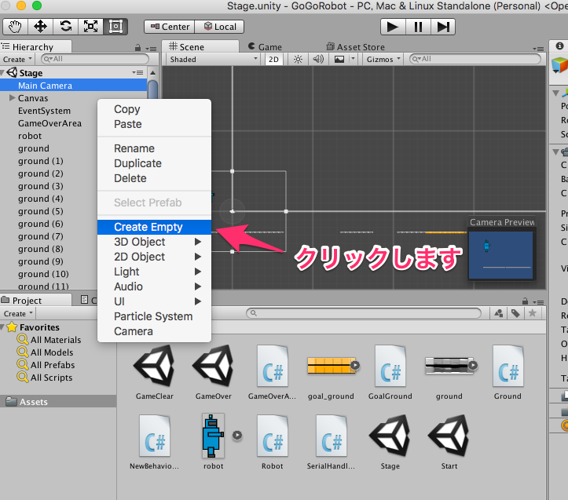

ヒエラルキーエリアの「SerialHandler」を選択します。プロジェクトエリアの「SerialHandler」スクリプトをインスペクターエリアにドラッグ&ドロップします。

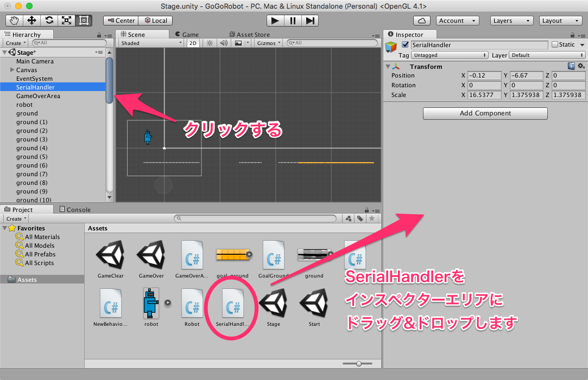

インスペクターエリアの「Port Name」を端末名に変更します。

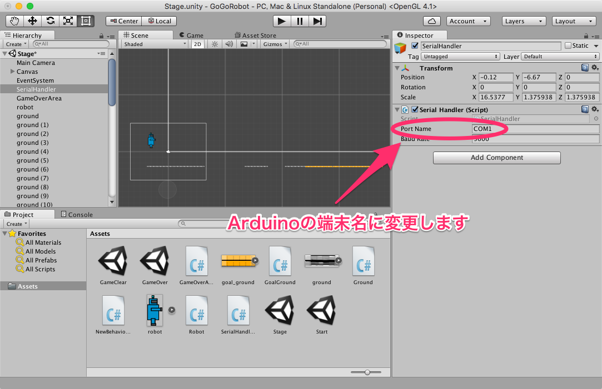

Arduinoの端末名は、Arduino IDEの上の方にある「ツール」 > 「シリアルポート」から確認することができます。

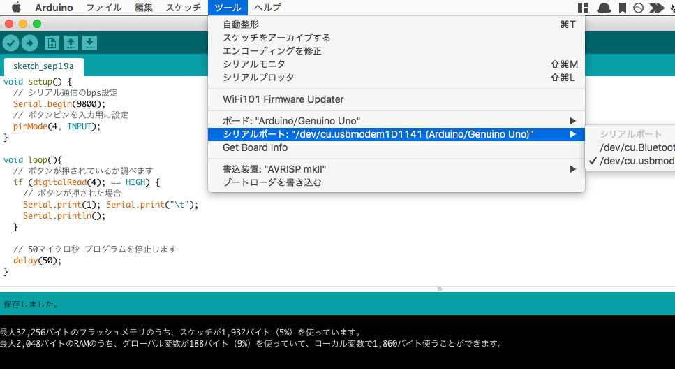

次に「Robot」スクリプトをダブルクリックしてエディタを開きます。スクリプトを以下のように変更します。

```cs
using UnityEngine;
using System.Collections;

public class Robot : MonoBehaviour {

	bool isGround = false;

	public SerialHandler serialHandler;

	// Use this for initialization
	void Start () { 
		//信号を受信したときに、そのメッセージの処理を行う
		serialHandler.OnDataReceived += OnDataReceived;
	}

	// Update is called once per frame
	void Update () {
		if (Input.GetKeyDown(KeyCode.Space) && isGround) {
			isGround = false;
			this.GetComponent<Rigidbody2D>().velocity = new Vector2(0.0f, 10.0f);
		}
	}

	// 衝突
	void OnCollisionEnter2D (Collision2D collision) {
		print("衝突しました");
		isGround = true;
	}

	//受信した信号(message)に対する処理
    void OnDataReceived(string message)
    {
		print("OnDataReceived");
		var data = message.Split(new string[]{"\t"}, System.StringSplitOptions.None);
        if (data.Length < 2) return;

        try {
        	// 地面についている状態
			if (isGround) {
				// 上向きに初速度10で移動
				this.GetComponent<Rigidbody2D>().velocity = new Vector2(0.0f, 10.0f);
				// 地面についていない
				isGround = false;
          	}
        } catch (System.Exception e) {
        	// 失敗した場合
            print(e.Message);
        }
    }
}
```

ヒエラルキーエリアの「robot」を選択して、インスペクターエリアにある「Serial Handler」の「None (Serial Handler)」とあるスペースにヒエラルキーエリアにある「SerialHandler」をドラッグ&ドロップします。

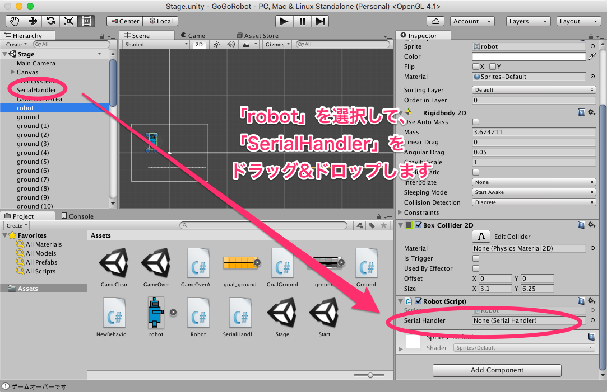

ゲームを実行してみましょう。ボタンを押すと、ロボットがジャンプするようになりました。

他にもいろいろなパーツを使って、あなただけのゲームコントローラーを作ってみましょう。
