# FaBo


FaBo(ファボ)は、FaBo,Incが開発しているツールで、LEDやセンサーとマイコンボードを簡単につなぐことができます。LEDライトを点滅させるためにArduinoと接続するには、故障させないように電気についての知識が必要になります。しかし、FaBoを

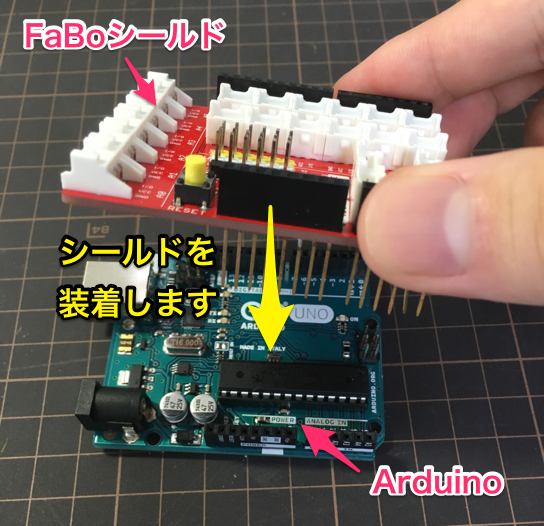

**FaBoシールドを装着したArduino**

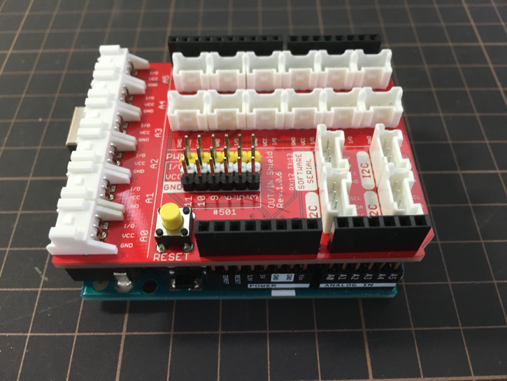

FaBoが提供するシールドを、ArduinoやRaspberry PIなどのマイコンボードに装着する。これだけで、LEDライトやボタン、加速度センサなどのパーツを簡単に利用できるのです。

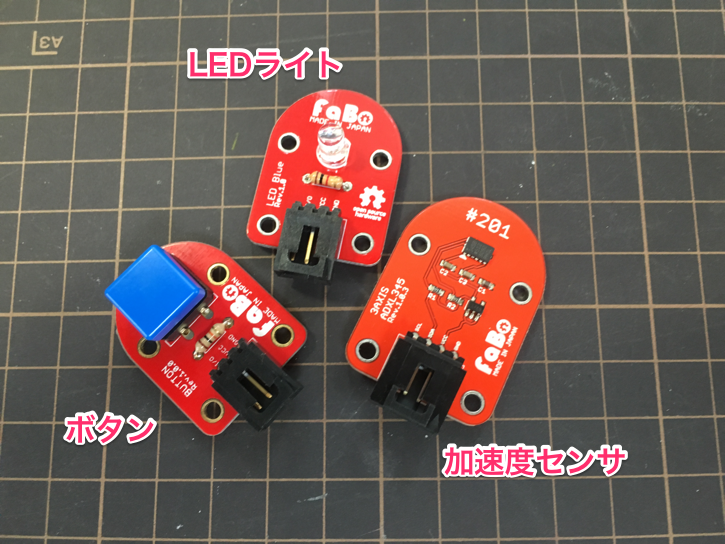

FaBoは、豊富なパーツを取り揃えています。温度センサ、感圧センサ、紫外線センサ、ブザー、７セグメントLED、可変抵抗…など。FaBoを使えば、早く、簡単に、これらのパーツを試すことが可能になります。

FaBoが用意するパーツは以下のサイトから確認することができます。

http://www.fabo.io/brick.html

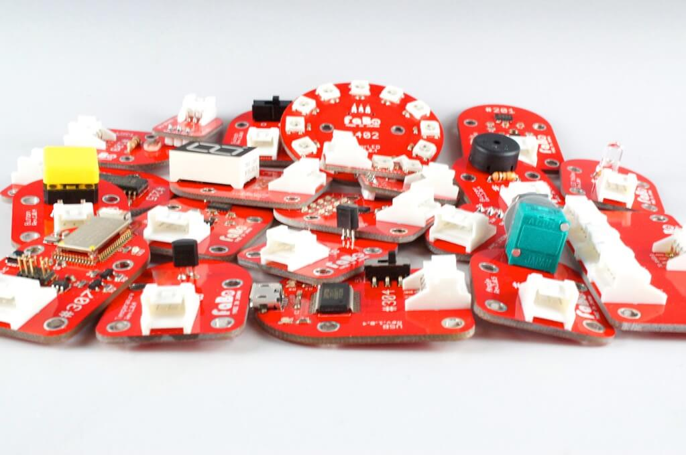

また、FaBoはArduinoだけではなくRaspberry PI、mbed、Ichigojamといったマイコンボードにも対応しています。FaBoのシールドを装着することで、どのマイコンボードでも豊富なパーツを使うことができます。


## Lチカをやってみよう

実際に、FaBoを使ってましょう。今回はLEDラントを点滅させてみます。最初の一歩にやるLED点滅を、IoTや電子工作の世界では「Lチカ」なんて呼んでいます。

### シールドにLEDライトを挿す

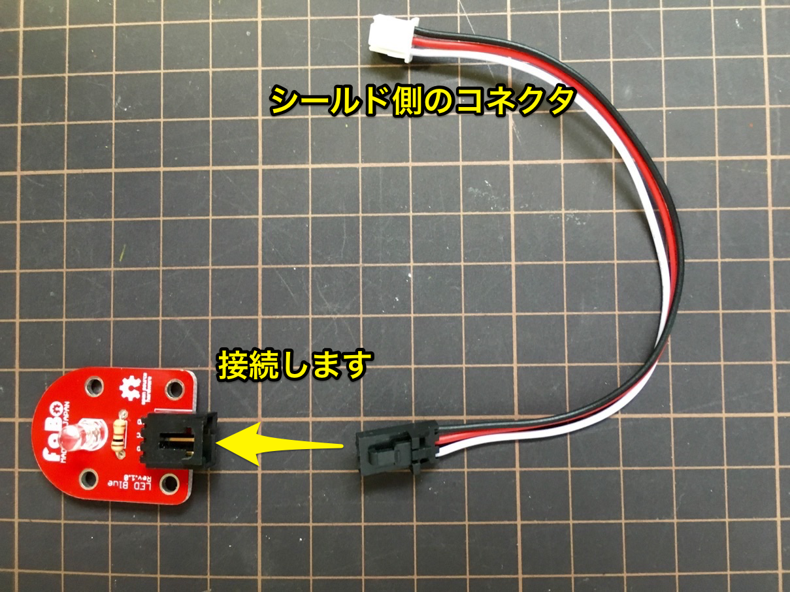

まず、FaBoのLEDパーツをコネクタに接続します。黒いほうはパーツに、白いほうはFaBoのシールドに接続することになります。

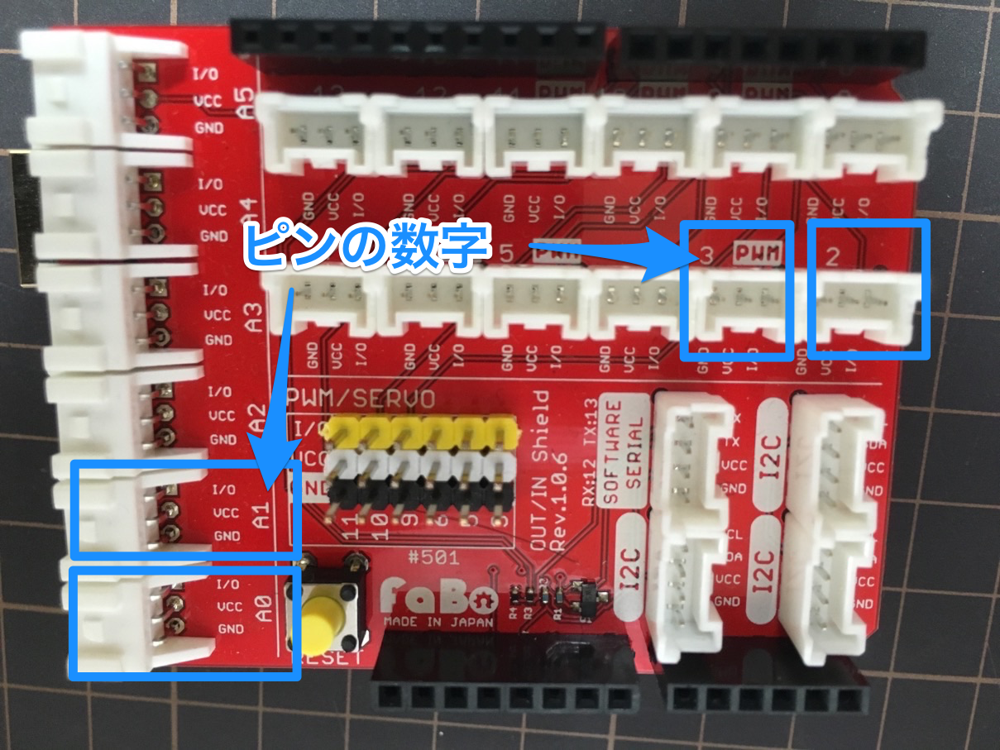

シールドのピン配置を確認します。ピンの近くに、A0やA1、2、3といった文字が書いてあります。コネクタに接続するピンの番号は覚えておきましょう。プログラミングをするときに使います。

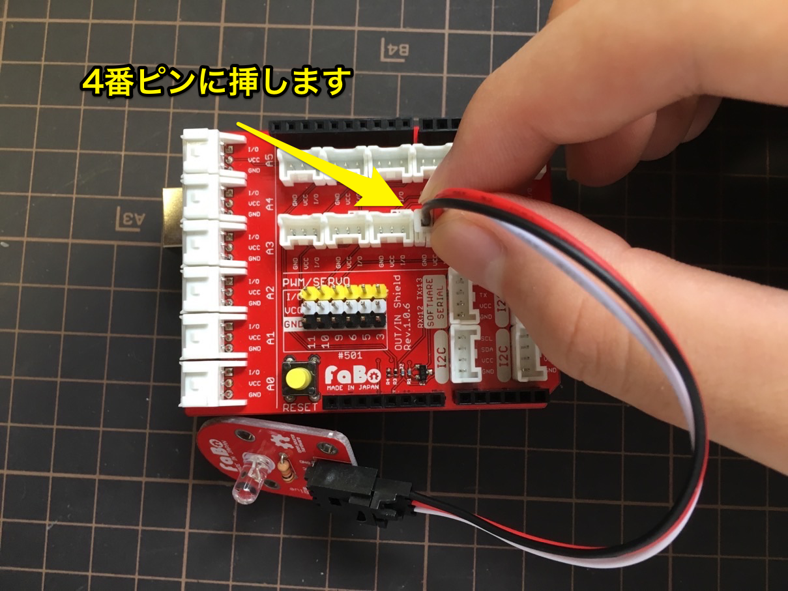

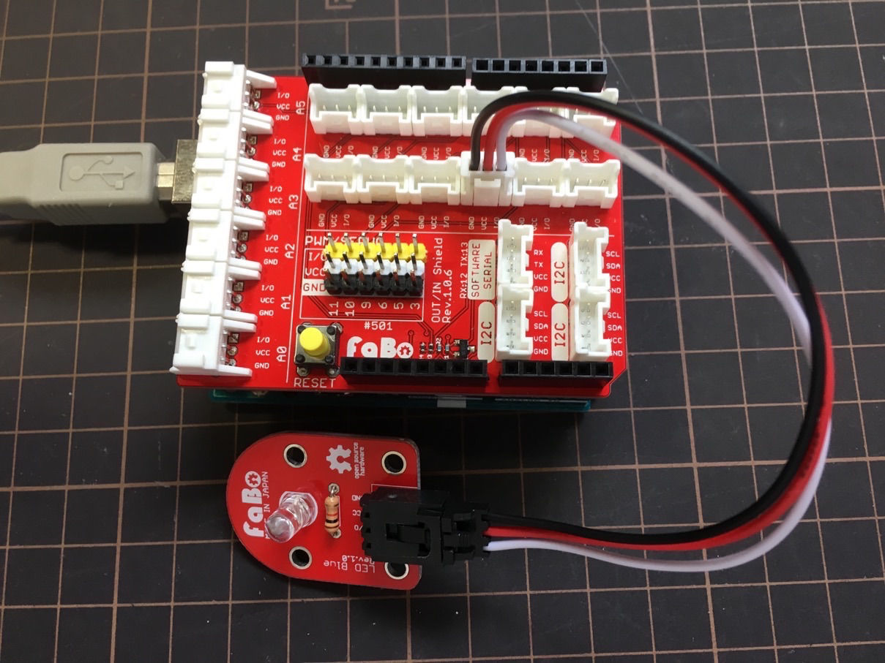

パーツをシールドの4番ピンに挿します。

### プログラミング

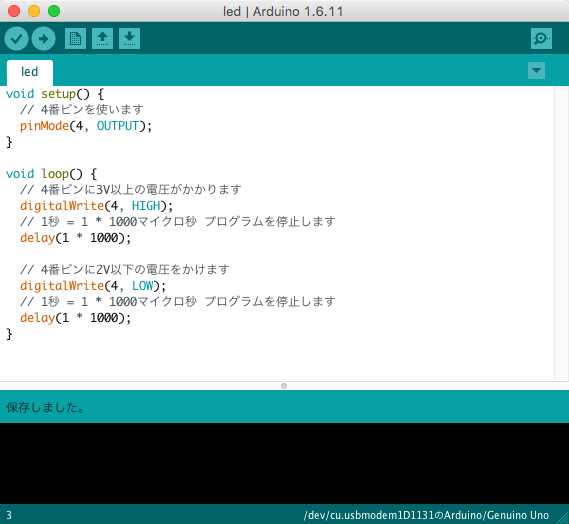

Arduino IDEを起動して、下のようなソースコードを書きます。

```ino
void setup() {
  // 4番ピンを使います
  pinMode(4, OUTPUT);
}

void loop() {
  // 4番ピンに3V以上の電圧がかかります
  digitalWrite(4, HIGH);
  // 1秒 = 1 * 1000マイクロ秒 プログラムを停止します
  delay(1 * 1000);
  
  // 4番ピンに2V以下の電圧をかけます
  digitalWrite(4, LOW);
  // 1秒 = 1 * 1000マイクロ秒 プログラムを停止します
  delay(1 * 1000);
}
```

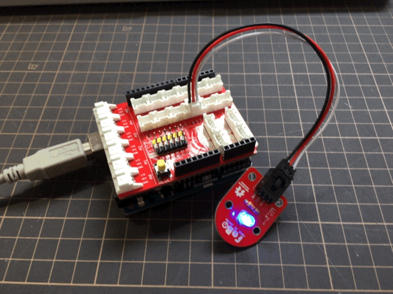

ビルドとプログラムの転送を行います。1秒おきにLEDが点滅していれば、成功です。

おめでとうございます。これがIoTのはじめの一歩です。FaBoにはボタンや温度センサなど、ワクワクするようなパーツが他にもあります。下のサイトを参考に別のパーツも試してみましょう。

* FaBo Starter Kit for Arduino 導入マニュアル
    * http://docs.fabo.io/fabo/starter/arduino/
* FaBo STEM Kit for Arduino 導入マニュアル
    * http://docs.fabo.io/fabo/stem/arduino/
* FaBo Arduino
    * https://fabo.gitbooks.io/faboandroiddocs/content/
* パーツごとのサンプルコード集
    * http://www.fabo.io/brick.html

## FaBoを使わない場合

もしFaBoを使わない場合はどうなるでしょうか？ブレッドボードを使って、配線をする必要があります。実際にやってみましょう。

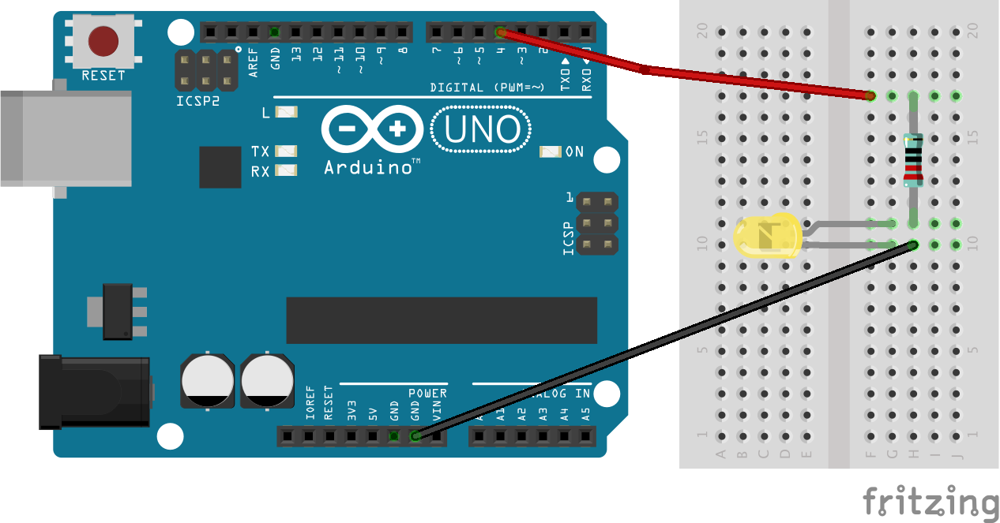

さっき使ったプログラムをArduinoに転送します。

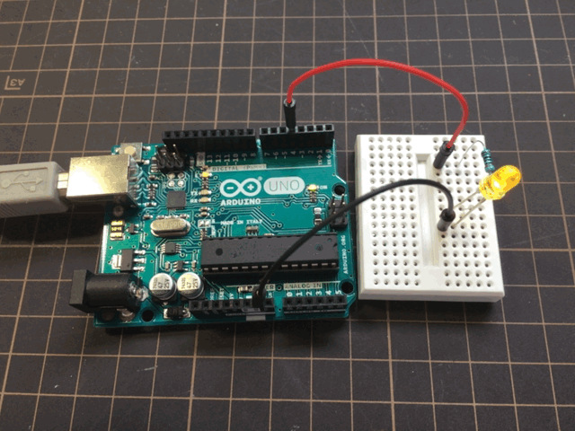

実際にLEDが点滅しました。

比べてみると、FaBoを使えば簡単にLチカができることが分かりますね。

