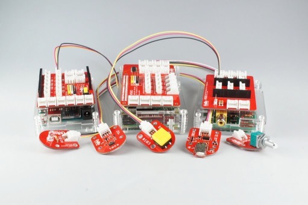
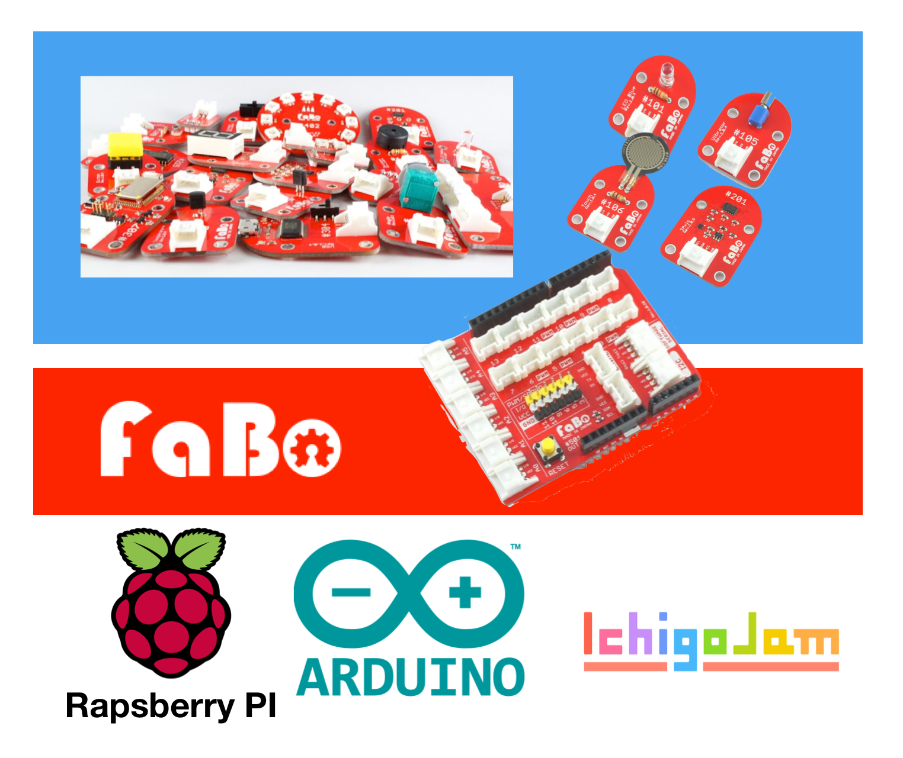

# FaBo

FaBo(ファボ)は、FaBo,Incが開発しているツールで、LEDやセンサーとマイコンボードを簡単につなぐことができます。

**FaBoシールドを装着したArduino**

FaBoが提供するシールドを、ArduinoやRaspberry PIなどのマイコンボードに装着する。これだけで、LEDライトやボタン、加速度センサなどのパーツを簡単に利用できるのです。

FaBoは、豊富なパーツを取り揃えています。温度センサ、感圧センサ、紫外線センサ、ブザー、７セグメントLED、可変抵抗…など。FaBoを使えば、早く、簡単に、これらのパーツを試すことが可能になります。

また、FaBoはArduinoだけではなくRaspberry PI、mbed、Ichigojamといったマイコンボードにも対応しています。FaBoのシールドを装着することで、どのマイコンボードでも豊富なパーツを使うことができます。

## Lチカをやってみよう

