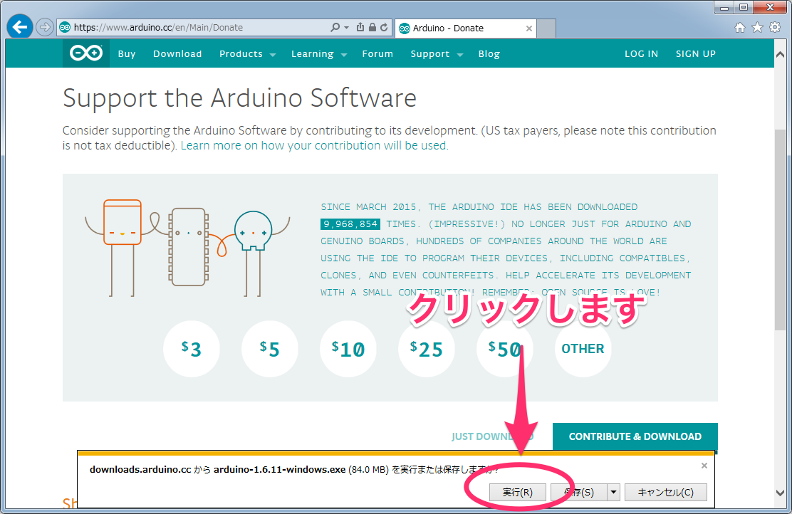
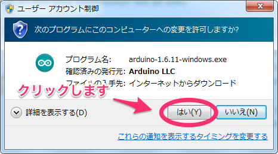
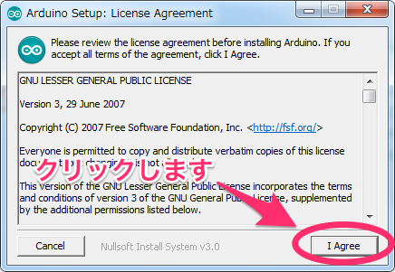
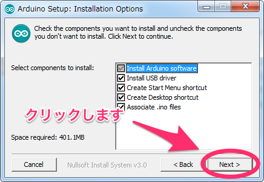
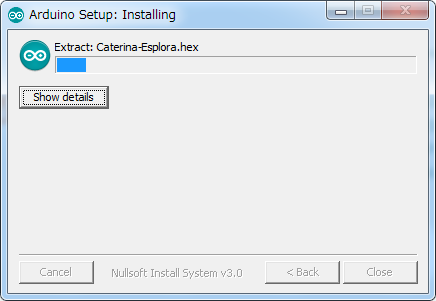
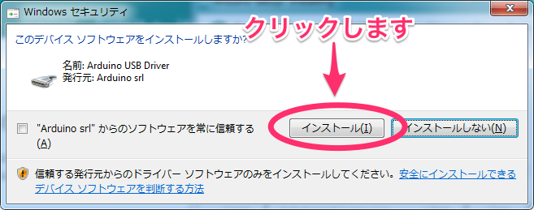
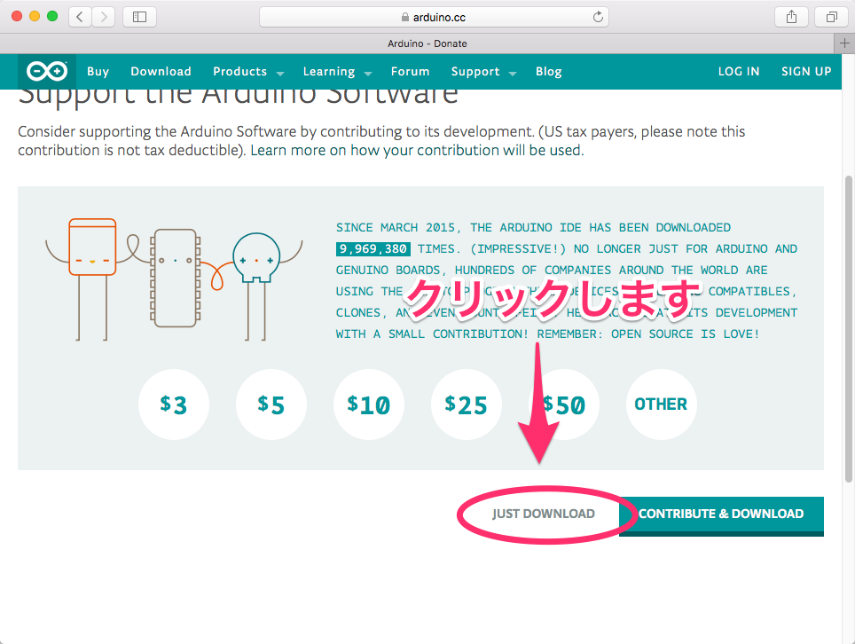

# Arduinoのインストール方法

Arduino IDEのインストール方法を説明します。

## Windows7

https://www.arduino.cc/en/Main/Software にアクセスし、「Windows Installer」をクリックします。

ページの下の方にあるJUST DONWLOADをクリックします。

「実行または保存しますか？」と聞かれるので、「実行」をクリックします。ダウンロードが開始するのでしばらく待ちます。

ダウンロードが終了すると、下のようなポップアップが表示されます。「はい」をクリックしましょう。

下のような画面が表示されます。「I Agree」をクリックしましょう。

「Next」をクリックしましょう。

「Install」をクリックしましょう。

インストールが開始されました。

ときおり下のような画面が表示されるかもしれません。「インストール」をクリックしましょう。

インストールが完了しました。「Close」をクリックしましょう。

## Mac OSX

https://www.arduino.cc/en/Main/Software にアクセスし、「Mac OS X 10.7 Lion or newer」をクリックします。

ページの下の方にあるJUST DONWLOADをクリックします。すると、ダウンロードが開始します。

