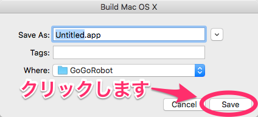

# Unity

Unityは、初心者からプロまで使えるゲーム開発環境です。一度作ったゲームは、iOSやAndroid、Windows、Mac OSXといったスマホやパソコンをはじめ、PlayStation、Xbox、WiiUなどのゲーム機上でも動かすことができます。

有名なゲームだと以下のものがUnityを使って作られています。

* ポケモンGO
* 魔法使いと黒猫のウィズ
* スマホ版のドラゴンクエスト8

今回は、簡単なゲームを作りながらUnityについて学んでいきたいと思います。


* YouTube
    * https://www.youtube.com/watch?v=abzupULmfjk

## Unityでゲームを作る方法

Unityには、画像やBGM、効果音、テキストなどを簡単に扱うための仕組みが備わっています。

下の画像はUnityでゲームを作る仕組みを示したものです。


シーンは、ゲームの1つの画面に対応します。このシーン上に、画像やBGM、ボタンなどの登場人物を作り上げていきます。

スクリプトは、ゲームのルールやキャラクターの動きを決める部分です。例えば、「ジャンケンに3回勝ったら、ゲームクリア」、「スペースを押したらキャラクターをジャンプさせる」。こういったルールを作りには、スクリプトを書かないといけません。

## プロジェクトの作成

Unityを起動して、右上の「NEW」をクリックします。


ゲーム名、ゲームのファイルを置く場所を入力し、「2D」にチェック、Enable Unity Analyticsを「OFF」にします。「Create project」をクリックします。


下のような画面(Mac OSX)が表示されます。


下の画面はWindows版です。どうでしょうか。どちらの画面もほとんど同じですね。


### 画面

画面の説明をしましょう。まず上にある「▶ボタン」はゲームのスタートボタンで、一番使う機能です。


Gameという部分では、実際にゲーム時に表示される画面が表示されます。


上のほうにある「Scene」をクリックすると、シーンが表示されます。


Hierarchy(ヒエラルキー)と呼ばれる部分は、シーンで使われる画像やBGM、効果音が表示されます。


Inspector(インスペクター)は、画像のサイズや位置、テキストの色などゲームの登場人物の設定を行う部分です。


Project(プロジェクト)は、ゲームで使われるあらゆるパーツが表示される部分です。


Project(プロジェクト)の隣りにある「Console」(コンソール)をクリックすると、デバッグ情報が表示されます。変数の中身やエラー情報を確認したい場合は、こちらを確認してください。


### テキストの表示

シーンにテキストを追加してみましょう。Hierarchy(ヒエラルキー)の部分で、右クリックして「UI」 > 「Text」をクリックします。


別の方法では、上の方にある「GameObject」 > 「UI」 > 「Text」をクリックするとテキストを追加することができます。


テキストが追加されましたか。下のように表示されていると思います。


シーンを表示した状態で、Textをドラッグしてみたり、文字の大きさや色を変えてみましょう。


### イベント

ボタンを押したら、別の画面(シーン)に移動させてみましょう。

「ボタンが押された」、「スペースキーが押された」、「キャラクターが衝突した」といった出来事(イベント)が起きたら、何かしたいことがあると思います。画面とユーザの交流が生まれることで、ゲームがより楽しくなりますね。そういったことをやりたい場合は、GameObject(ゲームオブジェクト)と呼ばれる登場人物を作って、イベントとゲームオブジェクトを結びつける必要があります。


まずゲームオブジェクトを作成します。Hierarchy(ヒエラルキー)の部分で右クリックをして、「Create Empty」をクリックします。


まずゲームオブジェクトにスクリプトを加えます。Inspector(インスペクター)部分の「Add Component」をクリックし、「New Script」 > 「Create and Add」をクリックします。


Project(プロジェクト)の「NewBehaviourScript」をダブルクリックします。


すると、MonoDevelopというエディタが起動します。すでに下のようなソースコードが書かれています。ここにイベントが起きたら、やりたいことを書いていきます。

```cs
using UnityEngine;
using System.Collections;

public class NewBehaviourScript : MonoBehaviour {

	// Use this for initialization
	void Start () {
	
	}
	
	// Update is called once per frame
	void Update () {
	
	}
}
```


Windowsの場合、Visual Stdioというエディタが起動します。


プログラミングをやる前に、スクリプトの仕組みをみてみましょう。Arduinoのソースコードと似ていないでしょうか。`Start()`と`Update()`という関数があります。最初に一度だけ実行される`Start()`関数、繰り返し実行される`Update()`関数があります。ちなみに、`Start()`と前に`Awake()`という関数が呼び出されています。


実際にコードを書いてみましょう。

```cs
using UnityEngine;
using System.Collections;

public class NewBehaviourScript : MonoBehaviour {

	// Use this for initialization
	void Start () {
	
	}
	
	// Update is called once per frame
	void Update () {
	
	}

	// こんにちは、と出力します
	public void Hello ()
	{
		print("こんにちは");
	}
}
```


今度は、Unityに戻りましょう。シーンにボタンを追加して、ボタンを好きな場所に移動させます。


ボタンを選択肢、Inspector(インスペクター)の下の方にある「On Click()」の「＋」をクリックします。


シーンの部分にある「GameObject」を、インスペクター部分にある「None」にドラッグ・アンド・ドロップします。


別の方法では、インスペクター部分にある「None」をクリックして、表示される画面の「Game Object」をクリックする方法もあります。


次に呼び出す関数を指定します。「On Click()」にある「No Function」 > 「NewBehaviourScript」 > 「Hello()」をクリックします。


さて、これで完了です。ゲームを動かしてみましょう。ボタンをクリックすると、コンソール部分に「こんにちは」と表示されました。


次のステップに行く前に、シーンの保存をしましょう。上のほうにある「File」 > 「Save Scene」をクリックします。


下のような画面が表示されるので、「Start.unity」という名前でシーンを保存します。


## 画面遷移

それではゲームの骨組みを作っていきます。下のような感じで画面を作ります。


### シーンの作り方

シーン(画面)の作り方をみていきます。プロジェクトの部分で右クリックして、「Create」 > 「Scene」をクリックします。


シーンの名前を「Stage」としましょう。


さて、スタート画面からステージ画面に移るようにしてみましょう。

プロジェクト部分にある「NewBehaviourScript」スクリプトをダブルクリックします。起動したエディタを使って、スクリプトに次のようなソースコードを追加します。

```cs
using UnityEngine;
using System.Collections;
using UnityEngine.SceneManagement;

public class NewBehaviourScript : MonoBehaviour {

	// Use this for initialization
	void Start () {
	
	}
	
	// Update is called once per frame
	void Update () {
	
	}

	// こんいちは、と出力します
	public void Hello ()
	{
		print("こんにちは");
	}

	// 別の画面に移ります
	public void JumpScene (string scene)
	{
		SceneManager.LoadScene(scene);
	}
}
```

追加した`JumpScene()`関数は引数として受け取った名前(`string scene`の部分ですね)の画面(シーン)に移ります。`scene`に遷移する画面名を教えてあげることで遷移します。

Unityに戻ってボタンの「On Click()」部分の「NewBehaviourScript.Hello()」を「JumpScene」に変更します。


すると入力部分ができているので、そこに「stage」と入力しましょう。この部分が`JumpScene (string scene)`の引数に相当します。


さて、ゲームを実行してみましょう。しかし、うまくいきません。エラーが出ているようです。


各画面(シーン)は別々に独立しているので、お互いに画面があることを教えてあげる必要があります。

上の方にある「File」 > 「Build Settings」をクリックします。


使用するシーンを「Scens In Build」の部分にドラッグ&ドロップします。このときに注意することがあります。先にくるシーンを上のほうにくるようにしなければいけません。「Start」、「Stage」の順になるようにしましょう。


「Build」をクリックします。


次にような画面が表示されますので、適当な名前を入力して「Save」をクリックします。



ゲームを実行してみましょう。スタート画面のボタンをクリックすると、何もない画面に移りました。


## インストール方法

### Windows

以下のサイトを参考にインストールしてください。

* https://unity3d.sakura.ne.jp/unity/install-windows.html
* http://qiita.com/decchi/items/9ea7af993825c1b46023

### Mac OSX

以下のサイトの「ダウンロード（Mac）」をクリックしてUnityをダウンロードします。

https://unity3d.com/jp/unity/qa/patch-releases/5.4.0p1


ダウンロードが完了したら、「UnityDownloadAssistant-5.4.0p1.dmg」をクリックします。以下のような画面が表示されるので、「Unity Download Assistant.app」をクリックします。


「開く」をクリックします。


「Continue」をクリックします。


「Continue」をクリックします。


「Agree」をクリックします。


「Continue」をクリックします。


パスワードを入力して、OKをクリックします。


「Continue」をクリックします。


Unityのダウンロードが開始します。


Unityのダウンロードが完了しました。


次にUnityを起動させましょう。下のような画面が出たら、「許可」をクリックしましょう。


Unityにログインします。IDとパスワードをお持ちのかたは入力し、「Sign In」をクリックします。


お持ちでない方は、Unityのアカウントを作成します。


ブラウザが起動し、以下のようなページが表示されます。メールアドレス、パスワード、ユーザー名、お名前、国名、ロボット対策の認証、ポリシーに同意するか、Unityからのお知らせをうけとるか(左上から順)を入力します。入力が完了したら、「Create a Unity ID」をクリックします。


確認のメールが送信されました。


PCまたはケータイからメールを確認しましょう。メールに「Link to confirm email」とあるのでクリックします。


アカウントの作成が完了しました。さきほどの画面に戻って、Unityにログインします。


IDとパスワードを入力し、「Sign In」をクリックします。


「Unity Personal」にチェックを入れて、「Next」をクリックします。


「I don't use Unity in a professional capacity.」にチェックを入れて、「Next」をクリックします。


アンケート画面になります。面倒でしたら、一番下にスクロールして「OK」をクリックしましょう。


「Start Using Unity」をクリックして、登録の完了です。


