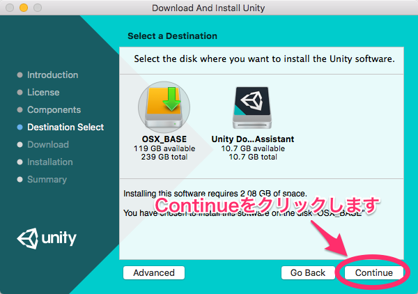

# Unity

## インストール方法

### Windows

以下のサイトを参考にインストールしてください。

* https://unity3d.sakura.ne.jp/unity/install-windows.html
* http://qiita.com/decchi/items/9ea7af993825c1b46023

### Mac OSX

以下のサイトの「ダウンロード（Mac）」をクリックしてUnityをダウンロードします。

https://unity3d.com/jp/unity/qa/patch-releases/5.4.0p1

ダウンロードが完了したら、「UnityDownloadAssistant-5.4.0p1.dmg」をクリックします。以下のような画面が表示されるので、「Unity Download Assistant.app」をクリックします。

「開く」をクリックします。

「Continue」をクリックします。

「Continue」をクリックします。

「Agree」をクリックします。

「Continue」をクリックします。

パスワードを入力して、OKをクリックします。

「Continue」をクリックします。

Unityのダウンロードが開始します。

Unityのダウンロードが完了しました。

次にUnityを起動させましょう。下のような画面が出たら、「許可」をクリックしましょう。

Unityにログインします。IDとパスワードをお持ちのかたは入力し、「Sign In」をクリックします。

お持ちでない方は、Unityのアカウントを作成します。

ブラウザが起動し、以下のようなページが表示されます。メールアドレス、パスワード、ユーザー名、お名前、国名、ロボット対策の認証、ポリシーに同意するか、Unityからのお知らせをうけとるか(左上から順)を入力します。入力が完了したら、「Create a Unity ID」をクリックします。

確認のメールが送信されました。

PCまたはケータイからメールを確認しましょう。メールに「Link to confirm email」とあるのでクリックします。

アカウントの作成が完了しました。さきほどの画面に戻って、Unityにログインします。

IDとパスワードを入力し、「Sign In」をクリックします。

「Unity Personal」にチェックを入れて、「Next」をクリックします。

「I don't use Unity in a professional capacity.」にチェックを入れて、「Next」をクリックします。

アンケート画面になります。面倒でしたら、一番下にスクロールして「OK」をクリックしましょう。

「Start Using Unity」をクリックして、登録の完了です。

